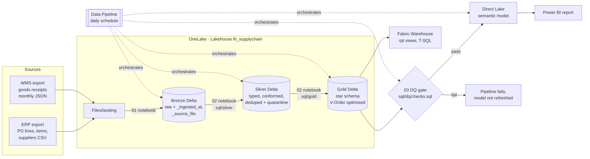
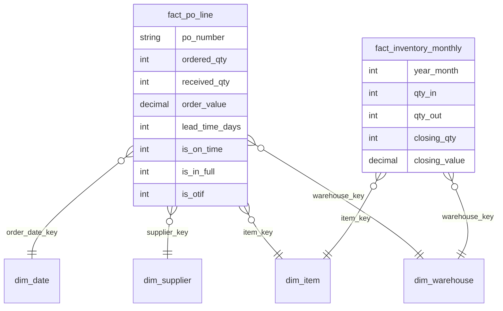

# Microsoft Fabric Lakehouse: End-to-End Supply-Chain Analytics

**A medallion lakehouse on Microsoft Fabric: OneLake landing → Bronze → Silver → Gold Delta tables → Fabric Warehouse views → Direct Lake semantic model, with a data-quality gate in the pipeline. The same SQL runs in CI on every push.**

[](https://github.com/Shashan4321/fabric-lakehouse-end-to-end/actions/workflows/ci.yml)


> **Business problem.** Procurement and finance need one trusted view of **supplier delivery performance (OTIF)** and **stock position** across 5 distribution centres. The source data comes from an ERP (purchase orders) and a WMS (goods receipts as JSON), with duplicates, bad codes and negative quantities. A bad load must never reach the dashboards.

| | |
|---|---|
| **Stack** | Microsoft Fabric (OneLake, Lakehouse, Notebooks/PySpark, Data Pipeline, Warehouse T-SQL, Direct Lake) · Power BI TMDL · Spark SQL · DuckDB (CI mirror) · pytest · sqlfluff |
| **Skills shown** | Medallion architecture · Delta Lake · data-quality gates · dimensional modelling · Direct Lake semantic models · supply-chain KPIs (OTIF, lead time, stock value) · CI for analytics code |
| **Data** | Synthetic ERP/WMS extracts: 6,000 PO lines, 6,633 goods-receipt records in 24 monthly JSON files, 200 items, 25 suppliers, 5 DCs (2024-2025) |

## Architecture



### Gold star schema



## One SQL codebase, two engines

The transformation logic lives in [`sql/`](sql) as plain SELECT statements in a portable subset of Spark SQL and DuckDB:

* **In Fabric:** [`02_silver_gold_transform.py`](fabric/notebooks/02_silver_gold_transform.py) renders each file and runs `CREATE OR REPLACE TABLE … USING DELTA AS …`.
* **In CI:** [`medallion.py`](src/fabriclh/medallion.py) runs the *same files* on DuckDB, applies the DQ gate and runs the tests. A test also blocks DuckDB-only syntax (`QUALIFY`, `::`, …) so the SQL keeps working on Spark.

The only dialect difference, date arithmetic, is a `{{ days_between(a, b) }}` placeholder, and it has its own test.

## Data-quality gate

[`sql/dq/checks.sql`](sql/dq/checks.sql) runs between Gold and the model refresh. Any non-zero check fails the pipeline:

| Check | Result on this data |
|---|---:|
| bronze receipts = silver + quarantine | 0 |
| duplicate receipt ids in silver | 0 |
| PO lines lost between silver and gold | 0 |
| received value reconciles (paise) | 0 |
| unknown warehouse codes in silver | 0 |

Bad records are kept in `silver_receipts_quarantine` with a reason, not silently dropped: **40** duplicate GRNs, **15** receipts for unknown PO lines, **8** non-positive quantities. The **60** warehouse codes that were padded or lower-case in the source are fixed in silver.

## In this project

Computed by `make landing run` on the seeded data:

| KPI | Value |
|---|---:|
| Supplier **OTIF** (delivered lines) | **71.9%** |
| On-time / In-full | 85.1% / 93.2% |
| Median lead time | 16 days |
| Worst suppliers by OTIF | SUP-017 (28.7%), SUP-021 (30.2%), SUP-025 (41.2%) |
| Best suppliers by OTIF | SUP-004 (93.8%), SUP-002 (93.4%), SUP-006 (91.6%) |
| Order value (2 years) | ₹267.74 crore |
| Closing stock value | ₹81.47 crore |

**Insight.** On-time (85%) is the bigger gap, not in-full (93%). Three suppliers are below 45% OTIF. A supplier review focused on promised dates for those three would lift overall OTIF more than chasing quantities.

## Direct Lake semantic model

[`fabric/SupplyChain.SemanticModel`](fabric/SupplyChain.SemanticModel/definition) (TMDL): 15 measures including OTIF %, On-Time %, In-Full %, Avg Lead Time, OTIF change vs last year (pts), Supplier OTIF rank (1 = worst), and **semi-additive** Closing Stock Qty/Value (latest month in context, not a sum over months). Partitions use `mode: directLake` on the Lakehouse SQL endpoint, so there is no import refresh and no data copy.

```dax
Closing Stock Value =
VAR _last = MAX ( fact_inventory_monthly[year_month] )
RETURN
    CALCULATE ( SUM ( fact_inventory_monthly[closing_value] ),
                fact_inventory_monthly[year_month] = _last )
```

## Run it

```bash
git clone https://github.com/Shashan4321/fabric-lakehouse-end-to-end.git
cd fabric-lakehouse-end-to-end
pip install -r requirements-dev.txt
make landing   # synthetic ERP/WMS files -> data/landing
make run       # bronze -> silver -> gold -> DQ gate (DuckDB), gold exported to Parquet
make test      # 8 tests
```

**On Fabric:** step-by-step in [`docs/deploy_on_fabric.md`](docs/deploy_on_fabric.md) (trial capacity is enough). Screenshots of the Lakehouse, pipeline run and Direct Lake report will be added here after deployment.

## Project structure

```text
├── sql/
│   ├── silver/                 # 7 conform/dedupe/quarantine queries
│   ├── gold/                   # 3 dims + fact_po_line + fact_inventory_monthly
│   └── dq/checks.sql           # quality gate
├── fabric/
│   ├── notebooks/              # 01 bronze ingest · 02 silver+gold · 03 DQ gate (PySpark)
│   ├── pipeline/               # Data Pipeline definition
│   ├── warehouse/01_views.sql  # T-SQL supplier scorecard + stock position
│   └── SupplyChain.SemanticModel/  # Direct Lake model (TMDL)
├── src/fabriclh/               # landing-file generator + local DuckDB runner
├── tests/                      # DQ, reconciliation, Spark-portability, model-vs-schema
└── docs/deploy_on_fabric.md
```

## Data & license

* **Data:** 100% synthetic, generated by [`landing.py`](src/fabriclh/landing.py) (seed 5). Supplier and item names are invented. No employer or client data, schema, screenshots or code are used.
* **Code:** MIT License.

## Author

**Shashank Singh**, Senior Data Analyst · [Portfolio](https://shashan4321.github.io) · [LinkedIn](https://www.linkedin.com/in/shashank-moon)

*Professional impact:* architected Microsoft Fabric Lakehouse, OneLake and Warehouse solutions integrated with Power BI for near-real-time analytics across Sales, Finance, HR and Supply Chain. This repo rebuilds the architecture on open, synthetic data.
